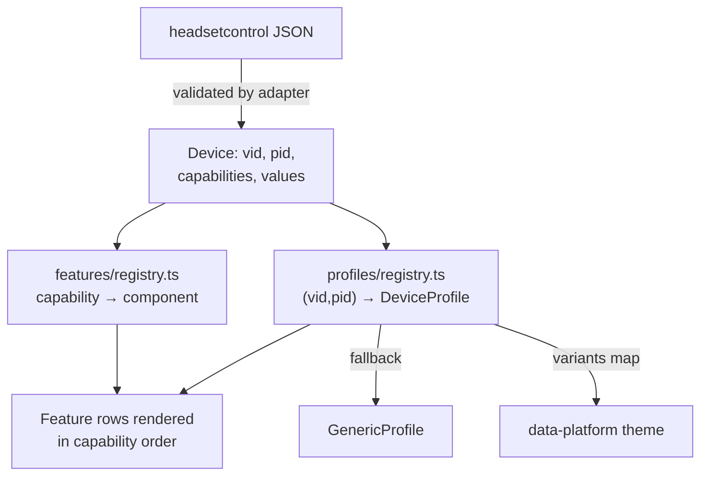

# Capabilities — the business logic

> **Status:** the adapter (#8) is built and reconciled below; the frontend half
> lands with #11 (stores), #12 (feature registry), #15 (variants), #17 (Maxwell 2
> profile) — reconcile this doc in those PRs.

The whole product rests on one idea: **the UI is rendered from what the device
says it can do** (`headsetcontrol --output json` → `capabilities` array), never
from a hardcoded device model. Example device report:
[`../fixtures/maxwell2-xbox-output-json.json`](../fixtures/maxwell2-xbox-output-json.json)
— a Maxwell 2 Xbox dongle reporting `CAP_SIDETONE`, `CAP_BATTERY_STATUS`,
`CAP_INACTIVE_TIME`, `CAP_CHATMIX_STATUS`, `CAP_VOICE_PROMPTS`,
`CAP_EQUALIZER_PRESET`, `CAP_NOISE_FILTER`.

## The two-registry model

**`features/registry.ts`** — one capability = one Vue component
(`CAP_SIDETONE` → `SidetoneRow.vue`, `CAP_EQUALIZER_PRESET` →
`EqualizerSection.vue`, …). Adding support for a new headsetcontrol feature =
one new file in `features/` + one registry entry. **Zero edits to existing
files** (OCP — this is the extension seam of the whole app).

**`profiles/registry.ts`** — `(vid, pid)` → `DeviceProfile`. Profiles carry the
*model-specific* knowledge Rust is forbidden to have: EQ preset names, band
frequencies, PID→platform `variants` map. Unknown device → `GenericProfile`
(everything still works, just without nice names). `DeviceProfile` is
interface-segregated: a profile declares only what it overrides.

## Division of knowledge (the hard boundary)

| Knows | Never knows |
|---|---|
| **Rust backend**: capabilities, values, how to call the binary | headset models, preset names, platforms |
| **Frontend profiles**: model quirks, preset names, platform variants | how JSON is fetched or validated |
| **Feature components**: how to render one capability | which device they serve, other capabilities |

## How a capability is read and written (the adapter, #8)

Reading is generic: `capabilities` stays a `Vec<String>` all the way to the UI,
so a `CAP_*` this build has never heard of arrives untouched. Rust never
enumerates the ones it "supports".

Writing needs one piece of vocabulary — which CLI flag a capability is set
through — so `backend/headsetcontrol.rs` holds a `CAP_* → flag` table
(`CAP_SIDETONE` → `-s`, `CAP_NOISE_FILTER` → `--noise-filter`, …). That is
*capability* knowledge, not model knowledge: every headset reporting
`CAP_SIDETONE` is written the same way. A capability outside the table is an
error rather than a silent no-op.

Only battery and chatmix can be **read back**; every other capability is
write-only in the CLI, which is why the store holds the last written value
([ADR 0009](../decisions/0009-headsetcontrol-adapter-seam.md)).

## Rules

- **Unknown capability** (new binary, older GUI): passed through by the adapter,
  and nothing renders for it in the UI — never a crash. Forward compatibility by
  default.
- **Capability absent** (feature removed, device variant lacks it): the row
  simply doesn't render. No dead controls.
- **Writes are optimistic**: store applies the value immediately, calls the
  backend, rolls back + toasts on failure (see
  [state-machine.md](state-machine.md)).
- Values shown in UI come from validated domain types (`types.gen.ts`), never
  raw JSON — the adapter is an anti-corruption layer
  (see [overview.md](overview.md)).
