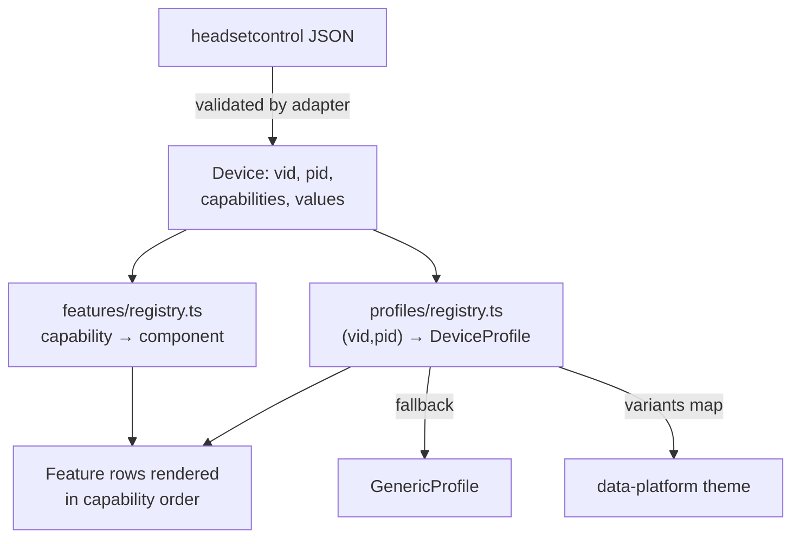

# Capabilities — the business logic

> **Status:** the adapter (#8), the stores (#11) and the feature rows (#12) are
> built and reconciled below; profiles land with #15 (variants) and #17
> (Maxwell 2) — reconcile this doc in those PRs.

The whole product rests on one idea: **the UI is rendered from what the device
says it can do** (`headsetcontrol --output json` → `capabilities` array), never
from a hardcoded device model. Example device report:
[`../fixtures/maxwell2-xbox-output-json.json`](../fixtures/maxwell2-xbox-output-json.json)
— a Maxwell 2 Xbox dongle reporting `CAP_SIDETONE`, `CAP_BATTERY_STATUS`,
`CAP_INACTIVE_TIME`, `CAP_CHATMIX_STATUS`, `CAP_VOICE_PROMPTS`,
`CAP_EQUALIZER_PRESET`, `CAP_NOISE_FILTER`.

## The two-registry model

```mermaid
flowchart TD
    JSON[headsetcontrol JSON] -->|validated by adapter| DEV[Device: vid, pid,\ncapabilities, values]
    DEV --> FREG["features/registry.ts\ncapability → component"]
    DEV --> PREG["profiles/registry.ts\n(vid,pid) → DeviceProfile"]
    PREG -->|fallback| GEN[GenericProfile]
    FREG --> ROWS[Feature rows rendered\nin capability order]
    PREG --> ROWS
    PREG -->|variants map| THEME[data-platform theme]
```

**`features/registry.ts`** — one capability = one Vue component
(`CAP_SIDETONE` → `SidetoneRow.vue`, `CAP_EQUALIZER_PRESET` →
`EqualizerSection.vue`, …). Adding support for a new headsetcontrol feature =
one new file in `features/` + one registry entry. **Zero edits to existing
files** (OCP — this is the extension seam of the whole app).

`featureRows(capabilities)` returns the rows in the order the device reports
them; a capability with no component is logged and skipped, and the battery is
listed as rendered elsewhere (the device header) so it is not mistaken for one.
Every row takes the same two props — the last value written and the device's
readings — and emits one `change` event, which is what lets `ReadyScreen` render
them in a single loop without naming a capability
([ADR 0014](../decisions/0014-feature-row-contract.md)).

**`profiles/registry.ts`** — `(vid, pid)` → `DeviceProfile`. Profiles carry the
*model-specific* knowledge Rust is forbidden to have: EQ preset names, band
frequencies, PID→platform `variants` map. Unknown device → `GenericProfile`
(everything still works, just without nice names). `DeviceProfile` is
interface-segregated: a profile declares only what it overrides.

## Division of knowledge (the hard boundary)

| Knows | Never knows |
|---|---|
| **Rust backend**: capabilities, values, how to call the binary | headset models, preset names, platforms |
| **Frontend profiles**: model quirks, preset names, platform variants | how JSON is fetched or validated |
| **Feature components**: how to render one capability | which device they serve, other capabilities |

## How a capability is read and written (the adapter, #8)

Reading is generic: `capabilities` stays a `Vec<String>` all the way to the UI,
so a `CAP_*` this build has never heard of arrives untouched. Rust never
enumerates the ones it "supports".

Writing needs one piece of vocabulary — which CLI flag a capability is set
through — so `backend/headsetcontrol.rs` holds a `CAP_* → flag` table
(`CAP_SIDETONE` → `-s`, `CAP_NOISE_FILTER` → `--noise-filter`, …). That is
*capability* knowledge, not model knowledge: every headset reporting
`CAP_SIDETONE` is written the same way. A capability outside the table is an
error rather than a silent no-op.

Only battery and chatmix can be **read back**; every other capability is
write-only in the CLI, which is why the store holds the last written value
([ADR 0009](../decisions/0009-headsetcontrol-adapter-seam.md)).

## Rules

- **Unknown capability** (new binary, older GUI): passed through by the adapter,
  and nothing renders for it in the UI — never a crash. Forward compatibility by
  default.
- **Capability absent** (feature removed, device variant lacks it): the row
  simply doesn't render. No dead controls.
- **Writes are optimistic**: `device.write(backend, capability, value)` applies
  the value immediately, calls the backend, and on a refusal rolls back and
  records the failure the toast shows. The rollback is skipped when a newer
  write to the same capability has already landed, so a slow failure cannot
  clobber what the user did next
  ([ADR 0013](../decisions/0013-stores-optimistic-writes.md)).
- **The store is the record of what was set**: with only battery and chatmix
  readable, `device.params[capability]` is where a feature component reads the
  current value from, and `device.readings` carries what the refresh loop read
  back.
- **A row with no value shows "unknown", never "off"**: the app has not read the
  device, and claiming a setting is off would be a lie about hardware.
- Values shown in UI come from validated domain types (`types.gen.ts`), never
  raw JSON — the adapter is an anti-corruption layer
  (see [overview.md](overview.md)).
