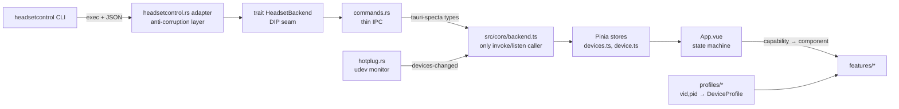

# System overview

A Linux desktop GUI (Tauri 2 + Vue 3) over the external
[`headsetcontrol`](https://github.com/Sapd/HeadsetControl) CLI. Two rules shape
the whole design:

1. **The UI is rendered from capabilities, not device models.**
   `headsetcontrol --output json` reports what a headset supports; each
   capability maps to exactly one Vue component.
2. **Rust knows nothing about headset models** — only capabilities and values.
   Model-specific knowledge lives in frontend profiles.

## Layers and seams

## Backend (Rust, `src-tauri/src/`)

- `backend/mod.rs` — `trait HeadsetBackend { list_devices(); get_state(id);
  set_param(id, param, value); }`. The DIP seam: a future native HID backend
  plugs in behind it with zero frontend changes.
- `backend/headsetcontrol.rs` — adapter that execs the binary and validates raw
  JSON into internal domain types. **The UI never sees raw headsetcontrol
  output.** Binary version is checked at startup; incompatibility becomes a
  dedicated error screen.
- `backend/hotplug.rs` — udev monitor filtered by known vendor IDs, emitting a
  `devices-changed` event; polling as fallback. Battery refresh ~5 s while the
  window is focused. The only module allowed OS-specific code.
- `commands.rs` — thin IPC commands; types exported to TS via tauri-specta.

## Frontend (Vue 3, `src/`)

- `core/types.gen.ts` — generated from Rust (tauri-specta), single source of
  truth for shared types. Never hand-edited.
- `core/backend.ts` — the **only** place calling `invoke()`/`listen()`.
- `core/stores/` — Pinia: `devices.ts` (list, selection, hotplug),
  `device.ts` (parameter state; writes are optimistic with rollback + toast).
- `profiles/` — `DeviceProfile` resolved by `(vid, pid)` with a
  `GenericProfile` fallback; holds EQ preset names, band frequencies, and the
  optional `variants: { [pid]: platform }` map driving platform accent colors.
- `controls/` — generic H-components (HSlider, HOptions, HStepper, HReadout);
  features never use raw inputs.
- `features/` — one capability = one component; `features/registry.ts` maps
  capability → component (OCP). Unknown capability: logged and ignored.

## App state machine

`checking-binary → missing-binary | bad-version | no-permissions(udev) |
no-device | ready(device) | device-lost` — each state has its own screen.
Details land in `state-machine.md` (issue #5).

## Extensibility in practice

- New headsetcontrol feature → new file in `features/` + one registry entry.
- New headset model → new file in `profiles/` + one registry entry.
- New data source → new `HeadsetBackend` implementation; frontend untouched.
