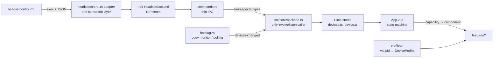

# System overview

A Linux desktop GUI (Tauri 2 + Vue 3) over the external
[`headsetcontrol`](https://github.com/Sapd/HeadsetControl) CLI. Two rules shape
the whole design:

1. **The UI is rendered from capabilities, not device models.**
   `headsetcontrol --output json` reports what a headset supports; each
   capability maps to exactly one Vue component.
2. **Rust knows nothing about headset models** — only capabilities and values.
   Model-specific knowledge lives in frontend profiles.

## Layers and seams

```mermaid
flowchart LR
    HC[headsetcontrol CLI] -->|exec + JSON| AD[headsetcontrol.rs adapter\nanti-corruption layer]
    AD --> TR[trait HeadsetBackend\nDIP seam]
    TR --> CMD[commands.rs\nthin IPC]
    CMD -->|tauri-specta types| BE[src/core/backend.ts\nonly invoke/listen caller]
    BE --> ST[Pinia stores\ndevices.ts, device.ts]
    ST --> APP[App.vue\nstate machine]
    APP -->|capability → component| FEAT[features/*]
    PROF[profiles/*\nvid,pid → DeviceProfile] --> FEAT
    UDEV[hotplug.rs\nudev monitor / polling] -->|devices-changed| BE
```

## Backend (Rust, `src-tauri/src/`)

- `backend/mod.rs` — `trait HeadsetBackend { detect(); list_devices();
  device_state(id); set_param(id, param, value); }` plus the domain types
  (`Device`, `DeviceState`, `Battery`, `ParamValue`, `BackendError`,
  `Detection`). The DIP seam: a future native HID backend plugs in behind it
  with zero frontend changes. The `headsetcontrol` adapter is what the app
  registers today.
- `backend/headsetcontrol.rs` — the adapter: validates the CLI's JSON into the
  domain types and decides success by *parsing*, since `headsetcontrol` exits 0
  even when an operation failed. **The UI never sees raw headsetcontrol output.**
  Pure apart from an injected `CliRunner`, which is what makes it testable from
  recorded fixtures with no binary installed
  ([ADR 0009](../decisions/0009-headsetcontrol-adapter-seam.md)).
- `backend/detect.rs` — the startup diagnosis: minimum `headsetcontrol` version
  and the `DeviceAccess` seam that tells "no udev rule" from "headset switched
  off". Pure; returns the `Detection` verdict the state machine renders
  ([ADR 0010](../decisions/0010-binary-detection-and-permission-diagnosis.md)).
- `backend/exec.rs` — the app's impure edges: the one
  `Command::new("headsetcontrol")` behind `CliRunner`, the hidraw lookup behind
  `DeviceAccess`, and the two `DeviceWatcher` implementations (`UdevWatcher`,
  `PollingWatcher`). No logic, so the coverage gate excludes it; the smoke E2E
  (#14) covers the real invocations.
- `backend/hotplug.rs` — the hotplug loop: wait for a signal from a
  `DeviceWatcher`, re-list devices, and emit `devices-changed` only when the set
  of device ids actually differs. Pure and fully gated; the OS-specific watchers
  live in `exec.rs`. udev filters on the `hidraw` subsystem — no vendor table,
  because the adapter's own listing decides what changed. Polling (3 s) is the
  fallback when there is no native watcher and when
  `HEADSET_DECK_WATCHER=polling` asks for it
  ([ADR 0011](../decisions/0011-hotplug-watcher-seam.md)).
- `commands.rs` — thin IPC commands; types exported to TS via tauri-specta.

## Frontend (Vue 3, `src/`)

- `core/types.gen.ts` — generated from Rust (tauri-specta) by `make gen`, single
  source of truth for shared types. Never hand-edited; CI fails on a stale copy.
- `core/backend.ts` — the **only** place calling `invoke()`/`listen()`, enforced
  by an ESLint rule. Exports the `HeadsetBackend` interface everything else
  depends on.
- `core/refresh.ts` — the value refresh loop: ticks every 5 s while the window
  is not hidden, pausing when it is. Hotplug is an event; battery and chatmix
  are not, so they are polled ([ADR 0011](../decisions/0011-hotplug-watcher-seam.md)).
- `core/mock-backend.ts` — a scripted `HeadsetBackend` (devices, states, latency,
  write errors, hung calls, hotplug) selected with `VITE_BACKEND=mock`
  (`make dev-mock`); the E2E suite drives it through `window.__headsetDeckMock`.
- `core/stores/` — Pinia: `devices.ts` (the connected list, and the selection
  kept as an id so a replugged headset stays selected) and `device.ts` (the
  values of the focused headset: readings from the refresh loop, the last value
  written per capability, and the write failure the toast shows). Actions take
  the `HeadsetBackend` as an argument; writes are optimistic with a
  ticket-guarded rollback
  ([ADR 0012](../decisions/0012-stores-optimistic-writes.md)).
- `profiles/` — `DeviceProfile` resolved by `(vid, pid)` with a
  `GenericProfile` fallback; holds EQ preset names, band frequencies, and the
  optional `variants: { [pid]: platform }` map driving platform accent colors.
- `controls/` — generic H-components (HSlider, HOptions, HStepper, HReadout,
  HToast); features never use raw inputs.
- `i18n/` — vue-i18n (pl + en, en fallback); every user-facing string is a
  catalog key, enforced by the `vue/no-bare-strings-in-template` lint rule.
- `features/` — one capability = one component; `features/registry.ts` maps
  capability → component (OCP). Unknown capability: logged and ignored.

## App state machine

`checking-binary → missing-binary | bad-version | no-permissions(udev) |
no-device | ready(device) | device-lost` — each state has its own screen.
Details: [state-machine.md](state-machine.md).

## Extensibility in practice

- New headsetcontrol feature → new file in `features/` + one registry entry.
- New headset model → new file in `profiles/` + one registry entry.
- New data source → new `HeadsetBackend` implementation; frontend untouched.
