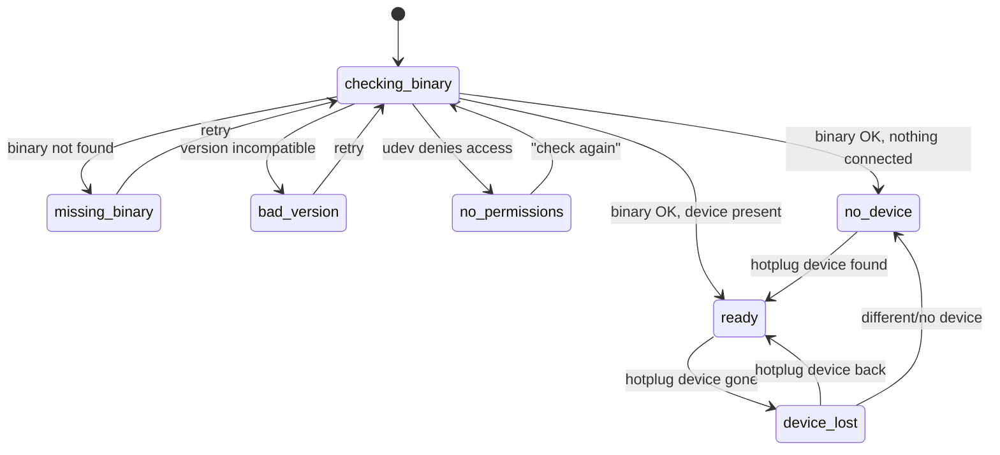

# Application state machine

> **Status:** specified (PROJECT.md §3.3). Implementation lands with issue #5
> (screens for binary states: #9) — reconcile this doc in those PRs.

The app is an **explicit** state machine; every state has its own full screen.
No screen ever renders partial/undefined state.

## States and their screens

| State | Screen shows |
|---|---|
| `checking-binary` | Startup probe: locate `headsetcontrol`, check version |
| `missing-binary` | Install instructions for `headsetcontrol`, per distribution |
| `bad-version` | Found binary is too old — required minimum + upgrade instructions |
| `no-permissions` | Ready-to-copy udev rule + a "check again" button |
| `no-device` | Binary fine, no supported headset connected |
| `ready(device)` | The main configurator, rendered from the device's capabilities |
| `device-lost` | Values dimmed in place; auto-returns to `ready` on hotplug |

## Transition sources

- **Startup** runs the `checking-binary` probe once; its outcome picks the first
  real state.
- **Hotplug** (`devices-changed` event from `backend/hotplug.rs`, polling as
  fallback) drives `no-device ↔ ready ↔ device-lost`. Connecting/disconnecting a
  headset updates the UI by itself — never requires a restart.
- **Retry buttons** on the three binary/permission screens re-run the probe.

## Error handling inside `ready`

These do **not** change the app state:

- **Parameter write fails** → roll back the optimistic update, show a discreet
  toast. (Store logic: issue #11.)
- **Unknown capability** in device JSON → logged and ignored, the row simply
  doesn't render. Forward compatibility — never a crash.

## Where it lives

The machine and its screens belong to `src/App.vue`; state screens are the only
place OS-specific *content* (e.g. distro-specific install instructions, udev
rules) is allowed on the frontend.
