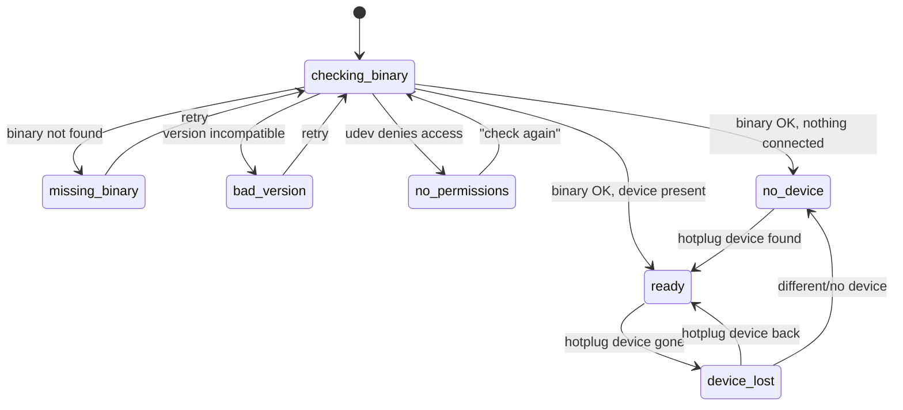

# Application state machine

> **Status:** implemented (#5). The `checking-binary` probe is still a
> placeholder — real binary/version/permission detection lands with #9, and the
> `ready` screen becomes the real configurator with #12.

The app is an **explicit** state machine; every state has its own full screen.
No screen ever renders partial/undefined state.

## States and their screens

| State | Screen shows |
|---|---|
| `checking-binary` | Startup probe: locate `headsetcontrol`, check version |
| `missing-binary` | Install instructions for `headsetcontrol`, per distribution |
| `bad-version` | Found binary is too old — required minimum + upgrade instructions |
| `no-permissions` | Ready-to-copy udev rule + a "check again" button |
| `no-device` | Binary fine, no supported headset connected |
| `ready(device)` | The main configurator, rendered from the device's capabilities |
| `device-lost` | Values dimmed in place; auto-returns to `ready` on hotplug |

## Transition sources

- **Startup** runs the `checking-binary` probe once; its outcome picks the first
  real state.
- **Hotplug** (`devices-changed` event from `backend/hotplug.rs`, polling as
  fallback) drives `no-device ↔ ready ↔ device-lost`. Connecting/disconnecting a
  headset updates the UI by itself — never requires a restart.
- **Retry buttons** on the three binary/permission screens re-run the probe.

## Error handling inside `ready`

These do **not** change the app state:

- **Parameter write fails** → roll back the optimistic update, show a discreet
  toast. (Store logic: issue #11.)
- **Unknown capability** in device JSON → logged and ignored, the row simply
  doesn't render. Forward compatibility — never a crash.

## Where it lives

- [`src/core/state-machine.ts`](../../src/core/state-machine.ts) — `AppState`,
  `AppEvent` and the pure `transition(state, event)`. All the logic, none of the
  rendering.
- [`src/core/probe.ts`](../../src/core/probe.ts) — the startup probe. Until #9 it
  asks the backend for devices and reports every failure as `missing-binary`.
- [`src/screens/`](../../src/screens/) — one component per state, mapped by
  `screens/registry.ts` (`SCREENS` + `screenProps`). Screens are the only place
  OS-specific *content* (distro install instructions, udev rules) is allowed on
  the frontend. All copy comes from vue-i18n (`src/i18n/`), never literals
  ([ADR 0007](../decisions/0007-i18n-vue-i18n.md)).
- [`src/App.vue`](../../src/App.vue) — holds the current state, dispatches
  events (probe result, hotplug, retry) and renders `<component :is>`. It
  decides nothing itself.

Adding a state = a variant in `AppState`, a screen component, one registry entry
— no edit to `App.vue` (ADR [0006](../decisions/0006-app-state-machine.md)).
