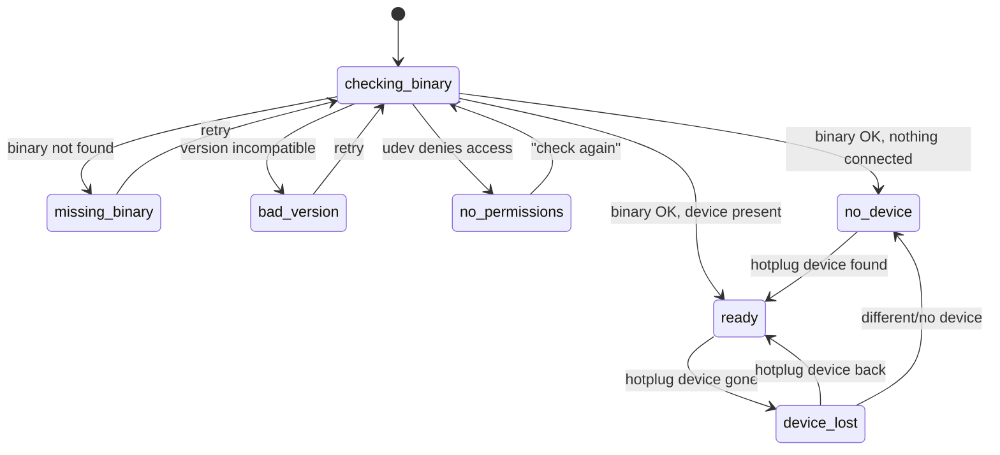

# Application state machine

> **Status:** implemented (#5), with real binary/version/permission detection
> behind it (#9). The `ready` screen becomes the real configurator with #12.

The app is an **explicit** state machine; every state has its own full screen.
No screen ever renders partial/undefined state.

```mermaid
stateDiagram-v2
    [*] --> checking_binary
    checking_binary --> missing_binary: binary not found
    checking_binary --> bad_version: version incompatible
    checking_binary --> no_permissions: udev denies access
    checking_binary --> no_device: binary OK, nothing connected
    checking_binary --> ready: binary OK, device present
    missing_binary --> checking_binary: retry
    bad_version --> checking_binary: retry
    no_permissions --> checking_binary: "check again"
    no_device --> ready: hotplug device found
    ready --> device_lost: hotplug device gone
    device_lost --> ready: hotplug device back
    device_lost --> no_device: different/no device
```

## States and their screens

| State | Screen shows |
|---|---|
| `checking-binary` | Startup probe: locate `headsetcontrol`, check version |
| `missing-binary` | Per-distribution dependencies + upstream's source build |
| `bad-version` | Found version vs. required minimum, then the same build steps |
| `no-permissions` | Ready-to-copy `headsetcontrol -u` udev rules + "check again" |
| `no-device` | Binary fine, no supported headset connected |
| `ready(device)` | The main configurator, rendered from the device's capabilities |
| `device-lost` | Values dimmed in place; auto-returns to `ready` on hotplug |

## Transition sources

- **Startup** runs the `checking-binary` probe once; its outcome picks the first
  real state.
- **Hotplug** (`devices-changed` event from `backend/hotplug.rs`, polling as
  fallback) drives `no-device ↔ ready ↔ device-lost`. Connecting/disconnecting a
  headset updates the UI by itself — never requires a restart. The event fires
  only when the listed device ids really changed, so a udev burst or a poll tick
  costs the frontend nothing ([ADR 0011](../decisions/0011-hotplug-watcher-seam.md)).
- **Retry buttons** on the three binary/permission screens re-run the probe.

## What the probe asks

Two questions, in this order ([ADR 0010](../decisions/0010-binary-detection-and-permission-diagnosis.md)):

1. `backend.detect()` — one CLI call whose json envelope carries the binary's
   own version *and* the device list. It answers `ready`, `missing_binary`,
   `bad_version { found, required }` or `no_permissions`; `found` is `null` when
   the binary's output could not be read at all. Rust decides all of it
   (`backend/detect.rs`), including the minimum version, so the UI holds no
   version knowledge.
2. `backend.listDevices()` — only once detection passed, because a device list
   read through a binary that cannot reach the hardware would just look like
   "no headset connected".

`no-permissions` is diagnosed at the device node, never from the CLI's `errors`
map: a powered-off headset and a missing udev rule produce identical output, so
the app opens the matching `/dev/hidraw*` instead and only blames udev when
every listed device refuses.

**Hotplug does not re-detect.** `refreshDevices()` re-lists devices and nothing
else — a plugged headset is no reason to re-check a binary, and re-probing
would double the CLI spawns on every event.

**Values are polled, not pushed.** Inside `ready`, `core/refresh.ts` re-reads
the selected device (`readDeviceState()`) every 5 s while the window is on
screen, and pauses while it is hidden. A failed read changes nothing: the last
values stay up, because a headset that went to sleep between two ticks is not a
state change.

## Error handling inside `ready`

These do **not** change the app state:

- **Parameter write fails** → the device store rolls the optimistic value back
  and records the failure; `App.vue` renders it as a discreet toast the user
  dismisses ([ADR 0013](../decisions/0013-stores-optimistic-writes.md)).
- **Unknown capability** in device JSON → logged and ignored, the row simply
  doesn't render. Forward compatibility — never a crash.

## Where it lives

- [`src/core/state-machine.ts`](../../src/core/state-machine.ts) — `AppState`,
  `AppEvent` and the pure `transition(state, event)`. All the logic, none of the
  rendering.
- [`src/core/probe.ts`](../../src/core/probe.ts) — `probe()` (detection, then
  the device list), `refreshDevices()` (the hotplug path) and
  `readDeviceState()` (the refresh path). Maps the backend's `Detection`
  verdicts onto `ProbeFailure`.
- [`src/core/refresh.ts`](../../src/core/refresh.ts) — the visibility-aware
  refresh loop driving `readDeviceState()`.
- [`src-tauri/src/backend/hotplug.rs`](../../src-tauri/src/backend/hotplug.rs) —
  the watcher loop deciding when `devices-changed` is worth emitting.
- [`src-tauri/src/backend/detect.rs`](../../src-tauri/src/backend/detect.rs) —
  the diagnosis itself: minimum version, and the `DeviceAccess` seam whose real
  hidraw implementation lives in `backend/exec.rs`.
- [`src/screens/`](../../src/screens/) — one component per state, mapped by
  `screens/registry.ts` (`SCREENS` + `screenProps`). Screens are the only place
  OS-specific *content* (distro install instructions, udev rules) is allowed on
  the frontend. All copy comes from vue-i18n (`src/i18n/`), never literals
  ([ADR 0007](../decisions/0007-i18n-vue-i18n.md)).
- [`src/App.vue`](../../src/App.vue) — holds the current state, dispatches
  events (probe result, hotplug, retry) and renders `<component :is>`. It
  decides nothing itself.

Adding a state = a variant in `AppState`, a screen component, one registry entry
— no edit to `App.vue` (ADR [0006](../decisions/0006-app-state-machine.md)).
