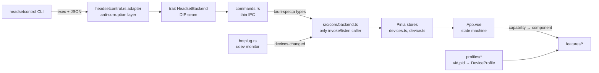

# Documentation System Implementation Plan

> **For agentic workers:** REQUIRED SUB-SKILL: Use superpowers:subagent-driven-development (recommended) or superpowers:executing-plans to implement this plan task-by-task. Steps use checkbox (`- [ ]`) syntax for tracking.

**Goal:** Create the living documentation skeleton (Diátaxis-lite + ADRs) in `docs/`, plus `CONTRIBUTING.md` and CLAUDE.md workflow integration, per issue #29.

**Architecture:** Documentation-only change. Three audience-separated areas: `docs/architecture/` (explanation for contributors + AI agent), `docs/decisions/` (ADRs), `docs/user/` (end-user how-to, placeholder until M3). `docs/README.md` maps it all; `CONTRIBUTING.md` is the human entry point; CLAUDE.md gets the maintenance rules.

**Tech Stack:** Markdown + Mermaid (GitHub-rendered). No build tooling.

## Global Constraints

- All new files in **English** (`docs/PROJECT.md` stays Polish — owner's spec exception).
- Files under `docs/architecture/` must stay ≤ ~150 lines.
- ADR convention: `NNNN-slug.md`, sections Status / Context / Decision / Consequences, immutable, superseding via a new ADR.
- Branch: `HC-29-docs-system`. Commits: Conventional Commits referencing `(#29)`. Never commit to `main`; do not merge the PR.
- Since this is a docs-only task, TDD test cycles are replaced by *write → verify (shell checks) → commit*.
- No code changes anywhere outside the files listed in tasks.

---

### Task 1: ADR infrastructure (`docs/decisions/`)

**Files:**
- Create: `docs/decisions/README.md`
- Create: `docs/decisions/0001-record-architecture-decisions.md`

**Interfaces:**
- Consumes: nothing.
- Produces: ADR template + numbering convention referenced by Task 2 (`architecture/README.md`), Task 4 (`CONTRIBUTING.md`) and Task 5 (CLAUDE.md edits). Directory path `docs/decisions/` is load-bearing for those links.

- [ ] **Step 1: Write `docs/decisions/README.md`**

```markdown
# Architecture Decision Records

Technical decisions in this project are captured as Architecture Decision Records
(ADRs) — short, immutable documents in [Nygard format](https://cognitect.com/blog/2011/11/15/documenting-architecture-decisions).

**Product decisions** (app name, MVP scope, visual direction) do NOT live here —
they go into the decision log in [`../PROJECT.md`](../PROJECT.md) §10 (Polish).
ADRs cover **technical** decisions: library choices, seams, formats, protocols.

## When to write an ADR

Write one whenever a decision:
- constrains future work (a seam, a wire format, a dependency), or
- resolves a trade-off that someone will later ask "why did they do it this way?"

Routine implementation choices that follow the spec need no ADR.

## Rules

- **Naming:** `NNNN-short-slug.md`, numbered sequentially (`0001`, `0002`, …).
- **Immutable:** never rewrite an accepted ADR. To change course, write a new ADR
  and mark the old one `Superseded by [NNNN](NNNN-slug.md)`.
- **Statuses:** `Proposed` → `Accepted` | `Rejected`; later possibly `Superseded`.
- Keep it short — a screenful. Context and consequences matter more than prose.

## Template

    # NNNN. Title (imperative, e.g. "Use tauri-specta for type generation")

    ## Status
    Accepted (YYYY-MM-DD)

    ## Context
    What forces are at play? What problem does this solve?

    ## Decision
    What we decided, stated actively: "We will …"

    ## Consequences
    What becomes easier, what becomes harder, what follow-up work this creates.

## Index

| # | Title | Status |
|---|---|---|
| [0001](0001-record-architecture-decisions.md) | Record architecture decisions | Accepted |
```

- [ ] **Step 2: Write `docs/decisions/0001-record-architecture-decisions.md`**

```markdown
# 0001. Record architecture decisions

## Status

Accepted (2026-07-23)

## Context

This project is developed autonomously by an AI agent, with the repository owner
reviewing PRs. Technical decisions were previously scattered across
`docs/PROJECT.md` §10 (a Polish decision-log table mixing product and technical
entries), PR descriptions, and commit messages. Contributors and the agent itself
need a durable, searchable record of *why* technical choices were made, in English.

## Decision

We will record technical decisions as Architecture Decision Records in
`docs/decisions/`, using the Nygard format (Status / Context / Decision /
Consequences), numbered `NNNN-slug.md`, immutable once accepted.

Product decisions (naming, scope, visual direction) stay in `docs/PROJECT.md` §10
(Polish) — that table remains the owner's product log.

## Consequences

- Every architectural decision made during implementation gains a permanent,
  linkable rationale; "why" questions get answered by `git log`-proof documents.
- Writing an ADR becomes part of the Definition of Done (CLAUDE.md) whenever an
  architectural decision is made mid-task — a small per-task cost.
- The split (product → §10 PL, technical → ADR EN) must be kept in mind when
  logging decisions; the rule lives in `docs/decisions/README.md` and CLAUDE.md.
```

- [ ] **Step 3: Verify**

Run: `wc -l docs/decisions/README.md docs/decisions/0001-record-architecture-decisions.md && grep -c '^## ' docs/decisions/0001-record-architecture-decisions.md`
Expected: both files exist; the ADR contains 4 `## ` sections (Status/Context/Decision/Consequences → count `4`).

- [ ] **Step 4: Commit**

```bash
git add docs/decisions/
git commit -m "docs: add ADR infrastructure with first ADR (#29)"
```

---

### Task 2: Architecture docs (`docs/architecture/`)

**Files:**
- Create: `docs/architecture/README.md`
- Create: `docs/architecture/overview.md`

**Interfaces:**
- Consumes: `docs/decisions/` path + ADR convention from Task 1 (linked from README).
- Produces: `docs/architecture/README.md` as the meta-guide referenced by Task 3 (`docs/README.md`) and Task 5 (CLAUDE.md step-6 pointer); `overview.md` as the first explanation file.

- [ ] **Step 1: Write `docs/architecture/README.md`**

```markdown
# Architecture documentation

Explanation-style docs (the [Diátaxis](https://diataxis.fr/) sense): they exist so
a contributor — human or AI agent — understands *how the system works and why*,
without reverse-engineering the code. Reference for facts, code for truth.

## Map

| File | Covers | Lands with |
|---|---|---|
| [overview.md](overview.md) | System map: layers, seams, data flow | exists |
| state-machine.md | App state machine, one screen per state | issue #5 |
| design-system.md | UI layer: tokens, H-components, platform accents | issue #6 |
| capabilities.md | Business logic: capability → UI, profiles, variants | issue #12 |
| testing.md | Test pyramid, contract fixtures, MockBackend, coverage | issues #3/#13 |

Files that don't exist yet are **planned** — see the growth rule below.

## Rules for maintaining these docs

1. **Growth rule:** a file is created together with the area it describes, in the
   same PR — never ahead of the code. The table above says which issue creates what.
2. **Living docs:** updating the relevant file here is part of every issue's
   Definition of Done (see [CLAUDE.md](../../CLAUDE.md)). A PR that changes an
   area's behavior updates that area's doc in the same PR.
3. **Short files:** ≤ ~150 lines each. If a file outgrows that, split it by
   responsibility and update the map above.
4. **Diagrams:** Mermaid in Markdown (renders on GitHub). No binary image files.
5. **Links to code:** relative paths from repo root, e.g. `src/core/backend.ts`.
   They are pointers, not contracts — code is the source of truth.
6. **Decisions live elsewhere:** *why* something was chosen goes into an
   [ADR](../decisions/README.md); these files describe *what is and how it works*.
7. **Language:** English. The owner's product spec stays in
   [PROJECT.md](../PROJECT.md) (Polish); on conflict about product intent,
   PROJECT.md wins — file an ADR or §10 row to resolve the drift.
```

- [ ] **Step 2: Write `docs/architecture/overview.md`**

Condensed EN translation of PROJECT.md §3 (do not invent content beyond it):

````markdown
# System overview

A Linux desktop GUI (Tauri 2 + Vue 3) over the external
[`headsetcontrol`](https://github.com/Sapd/HeadsetControl) CLI. Two rules shape
the whole design:

1. **The UI is rendered from capabilities, not device models.**
   `headsetcontrol --output json` reports what a headset supports; each
   capability maps to exactly one Vue component.
2. **Rust knows nothing about headset models** — only capabilities and values.
   Model-specific knowledge lives in frontend profiles.

## Layers and seams



## Backend (Rust, `src-tauri/src/`)

- `backend/mod.rs` — `trait HeadsetBackend { list_devices(); get_state(id);
  set_param(id, param, value); }`. The DIP seam: a future native HID backend
  plugs in behind it with zero frontend changes.
- `backend/headsetcontrol.rs` — adapter that execs the binary and validates raw
  JSON into internal domain types. **The UI never sees raw headsetcontrol
  output.** Binary version is checked at startup; incompatibility becomes a
  dedicated error screen.
- `backend/hotplug.rs` — udev monitor filtered by known vendor IDs, emitting a
  `devices-changed` event; polling as fallback. Battery refresh ~5 s while the
  window is focused. The only module allowed OS-specific code.
- `commands.rs` — thin IPC commands; types exported to TS via tauri-specta.

## Frontend (Vue 3, `src/`)

- `core/types.gen.ts` — generated from Rust (tauri-specta), single source of
  truth for shared types. Never hand-edited.
- `core/backend.ts` — the **only** place calling `invoke()`/`listen()`.
- `core/stores/` — Pinia: `devices.ts` (list, selection, hotplug),
  `device.ts` (parameter state; writes are optimistic with rollback + toast).
- `profiles/` — `DeviceProfile` resolved by `(vid, pid)` with a
  `GenericProfile` fallback; holds EQ preset names, band frequencies, and the
  optional `variants: { [pid]: platform }` map driving platform accent colors.
- `controls/` — generic H-components (HSlider, HOptions, HStepper, HReadout);
  features never use raw inputs.
- `features/` — one capability = one component; `features/registry.ts` maps
  capability → component (OCP). Unknown capability: logged and ignored.

## App state machine

`checking-binary → missing-binary | bad-version | no-permissions(udev) |
no-device | ready(device) | device-lost` — each state has its own screen.
Details land in `state-machine.md` (issue #5).

## Extensibility in practice

- New headsetcontrol feature → new file in `features/` + one registry entry.
- New headset model → new file in `profiles/` + one registry entry.
- New data source → new `HeadsetBackend` implementation; frontend untouched.
````

- [ ] **Step 3: Verify**

Run: `wc -l docs/architecture/README.md docs/architecture/overview.md`
Expected: both exist, each ≤ 150 lines.

Run: `grep -n 'mermaid' docs/architecture/overview.md && grep -n '](../decisions/README.md)' docs/architecture/README.md && grep -rn 'state-machine.md\|design-system.md\|capabilities.md\|testing.md' docs/architecture/README.md | head -5`
Expected: Mermaid block present; ADR link present; all four planned files listed in the map.

- [ ] **Step 4: Commit**

```bash
git add docs/architecture/
git commit -m "docs: add architecture docs with system overview (#29)"
```

---

### Task 3: docs index + user placeholder

**Files:**
- Create: `docs/README.md`
- Create: `docs/user/.gitkeep`

**Interfaces:**
- Consumes: paths from Tasks 1–2 (`architecture/README.md`, `decisions/README.md`).
- Produces: `docs/README.md` linked from Task 4 (`CONTRIBUTING.md`).

- [ ] **Step 1: Write `docs/README.md`**

```markdown
# Documentation map

| Path | Language | What it is |
|---|---|---|
| [PROJECT.md](PROJECT.md) | 🇵🇱 Polish | The owner's spec: vision, design system, architecture, standards, **product** decision log (§10). Source of truth for product intent. |
| [architecture/](architecture/README.md) | English | Living technical docs: how the system works and why. Start at [overview.md](architecture/overview.md). |
| [decisions/](decisions/README.md) | English | Architecture Decision Records (**technical** decisions, Nygard format). |
| [user/](user/) | English | End-user guides (installation, udev permissions, FAQ). Empty until the first release (M3). |
| [fixtures/](fixtures/) | — | Recorded `headsetcontrol --output json` outputs used by contract tests. |
| superpowers/ | English | AI-agent working artifacts: design specs and implementation plans per task. Historical record, not living docs. |
| [maxwell-control-mono.html](maxwell-control-mono.html) | — | Approved visual mock — the design authority for the UI. |

**Language policy:** everything in the repo is English, except `PROJECT.md` —
the owner's spec — and its §10 product decision log, which stay Polish.

**Maintenance:** docs are updated in the same PR as the code they describe —
see the rules in [architecture/README.md](architecture/README.md).
```

Note: the 🇵🇱 flag emoji is inside a Markdown doc, not application UI — the "no emoji in UI" rule does not apply. If in doubt, replace with the word "Polish".

- [ ] **Step 2: Create the user docs placeholder**

```bash
touch docs/user/.gitkeep
```

- [ ] **Step 3: Verify**

Run: `test -f docs/README.md && test -f docs/user/.gitkeep && grep -c '](architecture/README.md)' docs/README.md`
Expected: exits 0, grep count ≥ 1.

- [ ] **Step 4: Commit**

```bash
git add docs/README.md docs/user/.gitkeep
git commit -m "docs: add documentation map and user docs placeholder (#29)"
```

---

### Task 4: CONTRIBUTING.md

**Files:**
- Create: `CONTRIBUTING.md` (repo root)

**Interfaces:**
- Consumes: `docs/README.md` (Task 3), `docs/architecture/README.md` (Task 2), `docs/decisions/README.md` (Task 1), existing `Makefile` targets.
- Produces: the human-contributor entry point; linked from CLAUDE.md context only if needed later (no Task 5 dependency).

- [ ] **Step 1: Write `CONTRIBUTING.md`**

```markdown
# Contributing

Thanks for your interest! This project is a Linux GUI for
[headsetcontrol](https://github.com/Sapd/HeadsetControl), built with Tauri 2,
Vue 3 and Rust. It is developed largely by an AI agent under owner review — human
contributions are welcome and follow the same rules.

## Prerequisites

- Node.js ≥ 20 + npm (the project uses **npm**, not pnpm/yarn)
- Rust stable toolchain (edition 2024) with `cargo`
- Tauri 2 Linux system deps (`webkit2gtk` etc.) — see the
  [Tauri prerequisites](https://tauri.app/start/prerequisites/)
- Optional for real-device work: the `headsetcontrol` binary on `PATH`

## Getting started

```bash
make setup   # npm install + cargo fetch
make dev     # run the app in development mode
make help    # list all targets
```

`Makefile` at the repo root is the single command interface — prefer `make`
targets over raw `npm`/`cargo` calls.

## Before you open a PR

Run the full local gate:

```bash
make ci      # lint + coverage + E2E — must be green before pushing
```

Coverage thresholds are enforced in CI: 100% for logic layers (`core/`,
`stores/`, `profiles/`, Rust parser/adapter/state machine), 90% for UI
components. Tests come first — the project works TDD.

## Workflow

1. Pick an open issue (or open one — no issue, no work) and comment on it.
2. Branch from `main`: `HC-<issue>-<slug>`.
3. Commit using [Conventional Commits](https://www.conventionalcommits.org/),
   in English, referencing the issue: `feat(eq): draggable preset points (#16)`.
4. Open a PR to `main` with `Closes #<issue>` in the body. The owner reviews
   and squash-merges.

## Where things are documented

- [docs/README.md](docs/README.md) — map of all documentation
- [docs/architecture/](docs/architecture/README.md) — how the system works
  (update the relevant file in the same PR as your change — it is part of the
  Definition of Done)
- [docs/decisions/](docs/decisions/README.md) — record an ADR for any
  architectural decision your change makes

## Ground rules

- English everywhere in the repo (code, comments, commits, issues, PRs).
- No firmware updates or unverified write commands — runtime settings only.
- OS-specific code only in the designated modules (`backend/hotplug.rs`,
  OS-specific screens, binary discovery).
- License: GPL-3.0 — contributions are accepted under the same license.
```

- [ ] **Step 2: Verify**

Run: `test -f CONTRIBUTING.md && grep -c 'make ci\|Conventional Commits\|docs/README.md' CONTRIBUTING.md`
Expected: exit 0, count ≥ 3.

- [ ] **Step 3: Commit**

```bash
git add CONTRIBUTING.md
git commit -m "docs: add CONTRIBUTING.md contributor entry point (#29)"
```

---

### Task 5: CLAUDE.md workflow integration

**Files:**
- Modify: `CLAUDE.md` (three precise edits)

**Interfaces:**
- Consumes: paths `docs/architecture/README.md`, `docs/decisions/` (Tasks 1–2).
- Produces: workflow rules future tasks follow.

- [ ] **Step 1: Edit "Sources of truth" — register the new docs**

In `CLAUDE.md`, find:

```markdown
- `docs/PROJECT.md` — the spec (Polish): vision, design system, architecture, standards,
  decision log. **Read it before any implementation work.** New decisions go into its
  "Dziennik decyzji" (§10) table.
```

Replace with:

```markdown
- `docs/PROJECT.md` — the spec (Polish): vision, design system, architecture, standards,
  **product** decision log. **Read it before any implementation work.** Product decisions
  go into its "Dziennik decyzji" (§10) table.
- `docs/architecture/` — living technical docs (English); `docs/architecture/README.md`
  holds the map and the maintenance rules. `docs/decisions/` — ADRs for technical
  decisions (Nygard format; see its README for the template and the product/technical
  split).
```

- [ ] **Step 2: Edit "After the task" — decision split + docs pointer**

Find:

```markdown
- Implementation diverged from the issue description? Update the issue (`gh issue edit`).
- Architectural decision made along the way? Add a row to PROJECT.md §10.
```

Replace with:

```markdown
- Implementation diverged from the issue description? Update the issue (`gh issue edit`).
- Decision made along the way? **Product** decision → row in PROJECT.md §10 (PL);
  **technical** decision → new ADR in `docs/decisions/` (EN). Split defined in
  `docs/decisions/README.md`.
- Change touched an area described in `docs/architecture/`? Update that file in the
  same PR (map + rules: `docs/architecture/README.md`).
```

- [ ] **Step 3: Edit Definition of Done point 4**

Find:

```markdown
4. Docs updated where relevant (issue, PROJECT.md §10, this file).
```

Replace with:

```markdown
4. Docs updated where relevant: issue, `docs/architecture/` files for touched areas,
   ADR for technical decisions, PROJECT.md §10 for product decisions, this file.
```

- [ ] **Step 4: Verify**

Run: `grep -n 'docs/architecture/README.md\|docs/decisions/' CLAUDE.md | head -10 && grep -c 'Add a row to PROJECT.md §10' CLAUDE.md`
Expected: new references present in all three sections; old single-sentence decision rule gone (count `0` — grep exits 1, that is the expected "not found").

- [ ] **Step 5: Commit**

```bash
git add CLAUDE.md
git commit -m "docs: integrate documentation rules into agent workflow (#29)"
```

---

### Task 6: Final verification, push, PR

**Files:**
- None created; verification + PR only.

**Interfaces:**
- Consumes: all previous tasks.
- Produces: open PR closing #29.

- [ ] **Step 1: Whole-tree verification**

```bash
ls docs/ docs/architecture/ docs/decisions/ docs/user/ && test -f CONTRIBUTING.md
wc -l docs/architecture/*.md          # each ≤ 150
grep -rn '](' docs/README.md docs/architecture/*.md docs/decisions/*.md CONTRIBUTING.md \
  | grep -o '](\([^)h][^)]*\))' | tr -d '](' | tr -d ')' | sort -u \
  | while read -r f; do [ -e "docs/$f" ] || [ -e "$f" ] || echo "BROKEN? $f"; done
```

Expected: full skeleton present; no line-count violations; relative-link check prints nothing suspicious (manually confirm any `BROKEN?` lines — the naive check does not resolve `../`).

- [ ] **Step 2: Push and open PR**

```bash
git push -u origin HC-29-docs-system
gh pr create --title "docs: documentation system — architecture docs, ADRs, contributor guide (#29)" --body "Closes #29

## What
- \`docs/architecture/\` — living technical docs: README (map + maintenance rules) and overview.md (system map, Mermaid)
- \`docs/decisions/\` — ADR infrastructure (Nygard format) with ADR 0001
- \`docs/README.md\` — documentation map; \`docs/user/\` placeholder (fills at M3)
- \`CONTRIBUTING.md\` — human contributor entry point
- CLAUDE.md — docs maintenance wired into the autonomous workflow (sources of truth, after-task rules, Definition of Done)

## Why
Living per-PR documentation for three audiences (contributors, AI agent, end users), per the approved design spec (\`docs/superpowers/specs/2026-07-23-docs-system-design.md\`).

## Test evidence
Docs-only change — no code gates apply. Verified: file skeleton, ≤150-line limit on architecture files, relative links resolve, Mermaid renders (checked in PR preview)."
```

Expected: PR URL printed.

- [ ] **Step 3: Post-checks**

```bash
gh issue edit 29 --remove-label in-progress
```

Verify Mermaid renders in the GitHub PR "Files changed" preview of `overview.md`. Do **not** merge the PR — the owner reviews.
